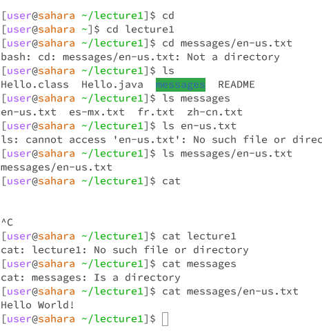

Screenshot: 

1. What the working directory was when the command was run?

The working directory when the cd command was run was lecture1, then /home, and then it changed directories to lecture1. The working directory when the ls and cat commands were run was 'lecture1'.

2. A sentence or two explaining why you got that output (e.g. what was in the filesystem, what it meant to have no arguments).

cd command: 
The reason I got no output when using cd with no argument is because it simply changed directories from lecture1 to the previous one and did not necessitate showing an output. Again, there was no output when I changed directories from /home to /lecture1 using /lecture1 as an argument, but you could see on the path that it had changed. When trying to use the cd command with a path to a file as an argument, I received a bash error as cd is used for changing directories, and a file is not a directory, so the command could not be executed. 

ls command:
Already in the /lecture1 directory, using ls without an argument allowed for the terminal to display the files in a list. Without changing directories, but still providing a different directory as an argument, ls displayed the files within "messages" in a list. Afterwords, ls was not able to display a list when a file was used as an argument, because it can only list files or directories. 

cat command: 
The cat command is used to concatenate or read the contents of a file, therefore when using the cat command without an argument,the terminal froze and was forced to stop. After, when using the cat command on a directory, it simply states what the argument (a directory) is. When utilizing a file as an argument with the cat command, it performs the task it is most used for: reading the file provided and responding with standard output.

3. Indicate whether the output is an error or not, and if it’s an error, explain why it’s an error.

I answered this on the previous prompt.
